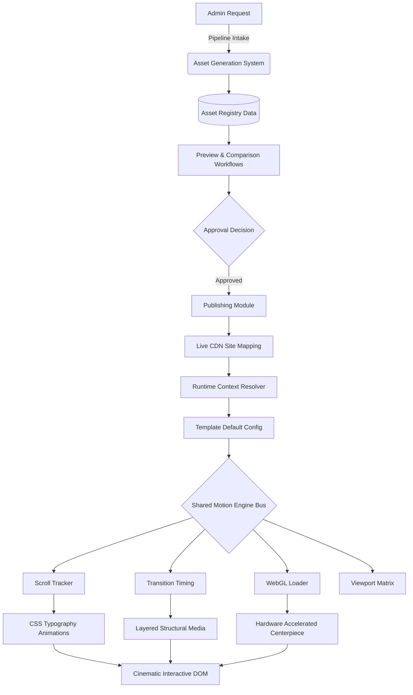
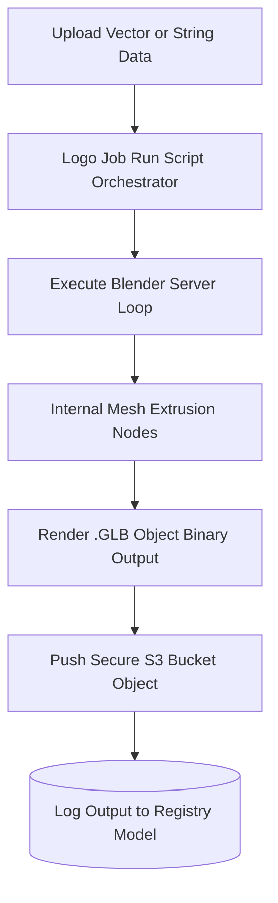
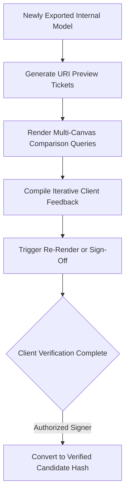
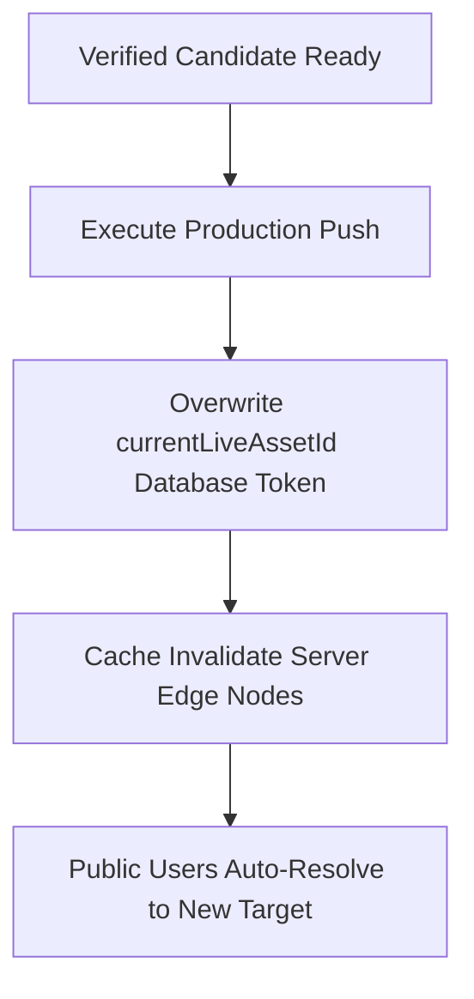
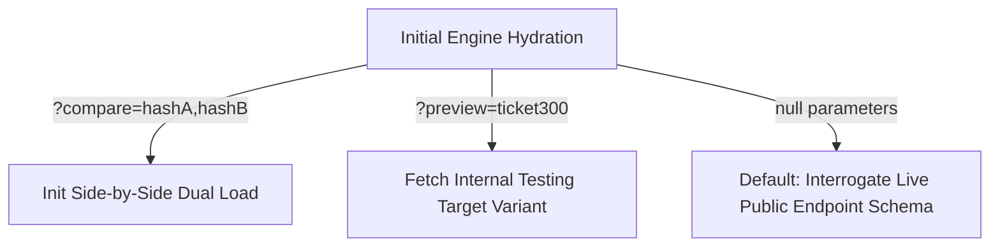
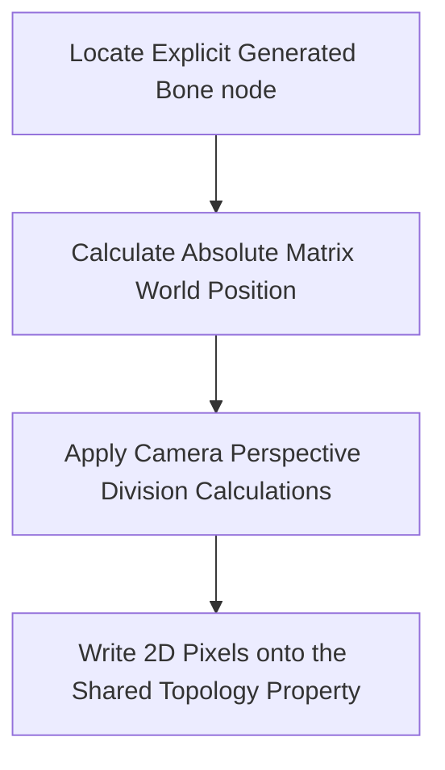
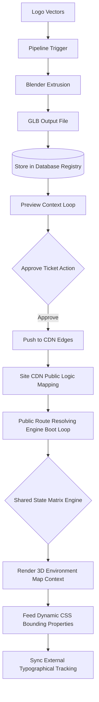

# Layrid Engine System Architecture Overview & Pipeline Map

This document is the foundational source of truth for the Layrid Cinematic Interactive Website Engine. It outlines the platform layers, strict file ownership rules, deterministic dependency flows, producer/subscriber architectures, canonical state contracts, and exact implementation phases. It also provides visual pipeline diagrams modeling the complete flow from asset generation to runtime interactive rendering.

## 1. System Architecture Layers
The platform is divided into four major, heavily decoupled layers.

### Layer A — Asset Creation Pipeline
**Responsible for:** Converting admin/client requests into runtime-ready physical assets.
**Modules:**
- Admin Asset Request
- Logo Job Runner
- Blender MCP Pipeline
- Asset Registry

**Responsibilities:** Validate requests, normalize generation parameters, dispatch Blender MCP jobs, track lifecycle, register .glb binaries, and group variants into asset families.

### Layer B — Workflow and Review
**Responsible for:** Human-in-the-loop approval before production deployment.
**Modules:**
- Preview Mode
- Comparison Mode
- Client Approval Links
- Feedback Layer
- Revision Queue
- Approval Workflow

**Responsibilities:** Isolate preview from production contexts, allow side-by-side asset comparison, track client feedback, issue revision generations, and manage final sign-off state.

### Layer C — Deployment and Operations
**Responsible for:** Production domain mapping and continuous operator visibility.
**Modules:**
- Site Live Mapping
- Deployment Sync
- Notifications
- Team Roles and Assignment
- Permissions
- Admin Control Panel (Dashboard)
- Analytics

**Responsibilities:** Physically bind approved assets to live site CDN slots, maintain fallback/rollback histories, expose pipeline health metrics, and stringently enforce Role-Based Access Control (RBAC).

### Layer D — Unified Runtime
**Responsible for:** The elite interactive website experience running locally on client devices.
**Modules:**
- Motion Engine / Shared State Bus
- Scroll Timeline Controller
- Transition Engine
- Typography Motion Library
- Layered Media Scene
- WebGL Scene Manager
- Template Config Controller
- Content Normalizer
- Section Layout Composer

**Responsibilities:** Establish a single unified runtime animation state, blindly orchestrate cinematic DOM transitions via spatial math, precisely map WebGL coordinate topologies back to HTML grids, and enforce identical behavioral parity regardless of a live, preview, or comparison URL context.

---

## 2. File Ownership Rules
Each module in the codebase must own a clearly defined responsibility and strictly adhere to boundaries.

* **pipeline/operations/LogoJobRunner.ts**
  - **Owns:** Generation job creation, MCP dispatch, lifecycle updates.
  - **Must Not Own:** Runtime resolution, approval flows, direct live publishing.
* **pipeline/registry**
  - **Owns:** Identity, variant relationships, storage metadata, runtime eligibility.
  - **Must Not Own:** Rendering logic, animation behavior.
* **pipeline/preview**
  - **Owns:** Resolution routing loops, candidate array constructions, session isolation.
  - **Must Not Own:** Publishing, runtime animation state.
* **pipeline/deployment**
  - **Owns:** Live asset slot mappings, rollback history, sync caching status.
  - **Must Not Own:** Asset generation, rendering implementation.
* **src/engine/runtime**
  - **Owns:** Shared runtime context limits, environment routing overrides, spatial math bounding, temporal transition state matrices, topology coordinate arrays.
  - **Must Not Own:** Explicit WebGL renderers, asset generation hooks.
* **src/engine/scroll**
  - **Owns:** Device scroll bounds, lerped velocities, progress scalars.
  - **Must Not Own:** WebGL meshes, Typography CSS transforms.
* **src/engine/transitions**
  - **Owns:** Route transition phases, layout hold overlays.
  - **Must Not Own:** Transforms or DOM layout overrides.
* **src/engine/typography**
  - **Owns:** CSS logic, transform matrices, anchor tracking formulas.
  - **Must Not Own:** Scroll ownership, GPU interaction.
* **src/engine/media**
  - **Owns:** Parallax image choreographies, depth layer compositing.
  - **Must Not Own:** Scroll calculations, deployment schemas.
* **src/engine/webgl**
  - **Owns:** `requestAnimationFrame` hooks, Three.js context, centerpiece loading loops, PBR materials, projection math.
  - **Must Not Own:** Business workflows, arbitrary DOM manipulation.
* **src/engine/config**
  - **Owns:** Template defaults, structural logic, breakpoint degradation mappings.
* **src/admin**
  - **Owns:** Dashboard UI matrices, job analytics readouts, RBAC gating.

---

## 3. Dependency Direction

> **Allowed Dependency Flow** (Top-Down only):
> Admin Input → Job Runner → Blender MCP → Asset Registry → Preview/Compare/Approve → Live Mapping → Runtime Config Resolver → Motion Engine Bus → Tracking Producers → Rendering Subscribers.

> **Forbidden Dependencies**: WebGL → Job Runner | Typography → Asset Registry | Preview → Direct Publishing | Media Scene → Mutating Scroll Ownership.

---

## 4. Producer vs Subscriber Architecture
The runtime state enforces a blind producer/subscriber limitation structure.
* **Producers (Writers):** Scroll Timeline, Transition Engine, Asset Resolver, WebGL Scene Mapper, Viewport Detector.
* **Subscribers (Readers):** Typography Motion, Layered Content DOM, WebGL Meshes, Section Decorators.
* **External Systems:** The Registry, Approval logic, and Analytics *never* run inside `requestAnimationFrame`.

---

## 5. Canonical Runtime State
All rendering adheres to this singular context contract natively over Vue composables:

```typescript
interface SharedRuntimeState {
  context: {
    siteId: string;
    sceneRole: 'hero-centerpiece';
    assetIds: string[];
    environment: 'live' | 'preview' | 'comparison';
    mode: 'live' | 'preview' | 'comparison';
  };
  spatial: {
    rawProgress: number;
    smoothedProgress: number;
    velocity: number;
    direction: 'up' | 'down';
    scrollY: number;
  };
  transitions: {
    phase: 'idle' | 'leaving' | 'overlap' | 'entering';
    progress: number;
    fromRoute?: string;
    toRoute?: string;
  };
  viewport: {
    width: number;
    height: number;
    breakpoint: 'desktop' | 'tablet' | 'mobile';
    degradedMode: boolean; // Flat PNG swaps
  };
  scene: {
    mode: 'logo-centerpiece' | 'layered-planes' | 'ambient' | 'none';
    activeCenterpieceAssetId?: string;
    emphasisTarget?: string;
  };
  topology: {
    anchors: Record<string, { x: number, y: number }>;
  };
}
```
No alternative runtime state objects are legally permitted.

---

## 6. Implementation Phases

**Phase 1 — Lock Runtime Spine**
- Finalize Motion Engine limits. Integrate local scroll/transition authorities. Map WebGL loading logic securely alongside CSS typography loops.

**Phase 2 — Prove Flagship Path**
- Follow an SVG intake completely through generation, registry, staging queries, live deployment slots, down to an active Three.JS mesh updating its screen bounds.

**Phase 3 — Production Safety**
- Force Mobile Degradation rules, performance caps, and explicit web memory garbage disposal mappings. Establish diagnostic telemetry hooks.

**Phase 4 — Operations Polish**
- Refine Admin dashboard metrics, drill-down capabilities, UI layouts, and RBAC granular security locks.

---

## 7. Immediate Priorities & Risks

### Strategic Priorities
1. **Priority 1:** Establish the Motion Engine as the supreme source of unified mathematical truth.
2. **Priority 2:** Construct the explicit end-to-end traversal of a Flagship Centerpiece variant.
3. **Priority 3:** Define Mobile processing limits and visual degradation strategies.

### Operational Risks
* **A:** Extraneous Admin UI features outpacing critical frontend rendering stability.
* **B:** Parallel state properties existing in disparate Vuex trees.
* **C:** Preview/Compare queries implicitly breaking the Native production fallback logic.
* **D:** WebGL rendering unbounded polygons resulting in mobile browser termination.

### Elite Completion Definition
1. Motion Engine acts as the sole runtime authority.
2. Preview, Comparison, and Live instances run the physically identical JS logic paths.
3. WebGL screen projection mathematically controls native HTML DOM node bounds.
4. Administrative Publishing mutations occur cleanly without runtime side effects.

> **Final Recommendation:** Reject expanding feature sets sideways. Drill ruthlessly into completing the deep vertical spine linking generation scripts strictly down to CSS matrices.

---

# Layrid Engine System Map

The following Mermaid diagrams visualize the precise sequence pipelines described logically above.

### 1. High Level Architecture Overview



### 2. Asset Generation Pipeline



### 3. Workflow Lifecycle



### 4. Publishing / Sync Mapping Loop



### 5. Runtime Asset Resolution Path



### 6. WebGL Anchor Loop Projection



### 7. End-to-End Vertical Flagship Path


